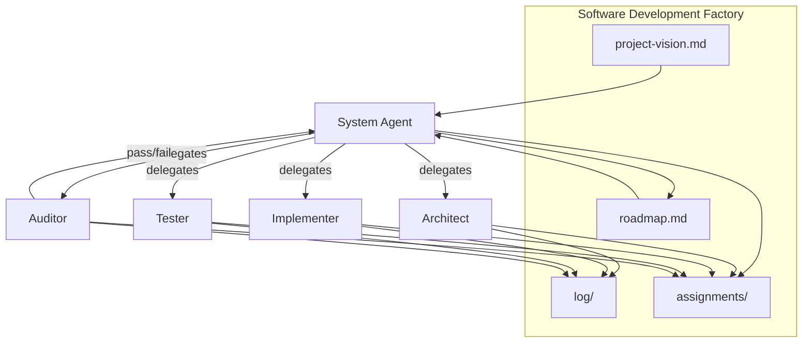

# Software Development Factory

Multi-agent orchestration for building software in Cursor. A **system** overseer delegates to specialists, tracks a **roadmap** toward a **project vision**, and ensures quality through an **auditor**.

## Architecture



## Agents

| Agent | Invoke | Role |
|-------|--------|------|
| **System** | `/system` | Oversees project, delegates tasks, tracks roadmap, adjusts plan |
| **Architect** | `/architect` | Architecture and folder structure |
| **Implementer** | `/implementer` | Application code and features |
| **Tester** | `/tester` | Create and conduct e2e tests |
| **Auditor** | `/auditor` | Verify assignments are truly complete |

Agent definitions: [.cursor/agents/](.cursor/agents/)

## Artifacts

| File | Purpose |
|------|---------|
| [factory/project-vision.md](factory/project-vision.md) | What the end result should look like |
| [factory/roadmap.md](factory/roadmap.md) | Milestones and progress toward the vision |
| [factory/assignments/](factory/assignments/) | Work packages for specialist agents |
| [factory/log/](factory/log/) | Append-only JSONL action log |
| [factory/milestone-paths.json](factory/milestone-paths.json) | Path prefixes protected when milestones are `done` |

## Hooks (automation)

Configured in [.cursor/hooks.json](.cursor/hooks.json). See [.cursor/hooks/README.md](.cursor/hooks/README.md).

| # | Event | What it does |
|---|-------|--------------|
| 1 | `subagentStart` / `subagentStop` | Auto-log lifecycle + agent messages (prompts, responses, follow-ups) |
| 2 | `subagentStart` | Require assignment context for architect/implementer/tester |
| 3 | `subagentStop` | Follow-up to invoke `/auditor` after specialist completes |
| 4 | `subagentStart` | Gate `/auditor` until assignment completed + logged |
| 5 | `sessionStart` | Inject vision and roadmap context when enough content is available |
| 6 | `preToolUse` | Block writes, deletes, and replacements under done milestones; log Task delegations |
| 7 | `postToolUse` | After the architecture doc declares paths, warn on out-of-scope edits; log Task tool results |
| 8 | `afterAgentResponse` | Log factory-related assistant responses |
| 9 | `beforeShellExecution` / `git push` | Block remote pushes; local commits remain allowed |

## Skills (deterministic tools)

| Skill | Purpose |
|-------|---------|
| **factory-log** | Append structured log entries |
| **factory-delegate** | Create assignments and delegation prompts |
| **factory-roadmap** | Update milestone and assignment status |
| **factory-audit** | Pre-audit checklist before invoking auditor |

Skills: [.cursor/skills/](.cursor/skills/)

## Rules

Workspace rules in [.cursor/rules/factory-workspace.mdc](.cursor/rules/factory-workspace.mdc) apply to all sessions in this repo.

## Workflow

1. **Define vision** — Edit `factory/project-vision.md`
2. **Plan roadmap** — Edit `factory/roadmap.md` with milestones
3. **Orchestrate** — `/system` reads vision + roadmap, delegates via **factory-delegate**
4. **Execute** — Specialists (`/architect`, `/implementer`, `/tester`) complete assignments and log actions
5. **Verify** — `/auditor` validates completion; system updates roadmap on pass
6. **Adjust** — System re-sequences milestones and logs adjustments as needed

## Logging

All agents log actions:

```bash
python .cursor/skills/factory-log/scripts/log-action.py \
  --agent system \
  --action delegated \
  --assignment-id architect-M1-01 \
  --milestone M1 \
  --summary "Delegated initial architecture"
```

Logs append to `factory/log/YYYY-MM-DD.jsonl`. Message bodies are stored in `factory/log/messages/YYYY-MM-DD/`. View the thread:

```bash
python .cursor/skills/factory-log/scripts/view-messages.py
```

## Quick start

```
Fill in factory/project-vision.md and factory/roadmap.md, then:

/system

Read the factory artifacts and delegate the first milestone.
```
